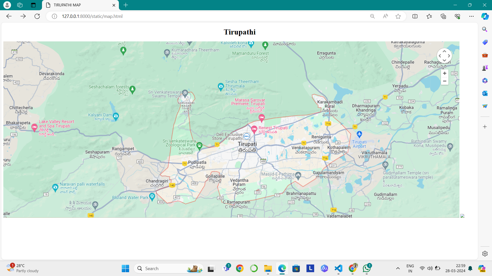
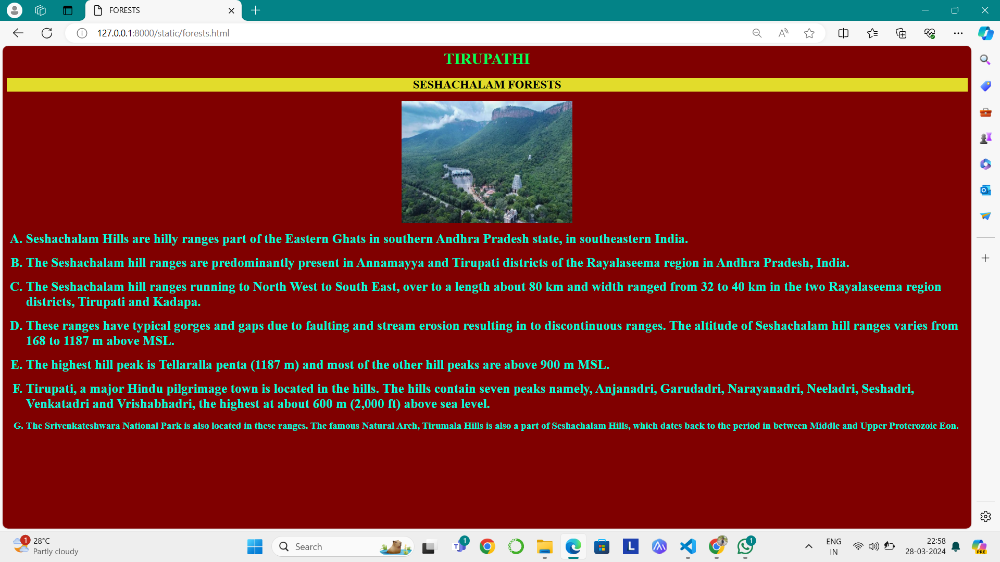
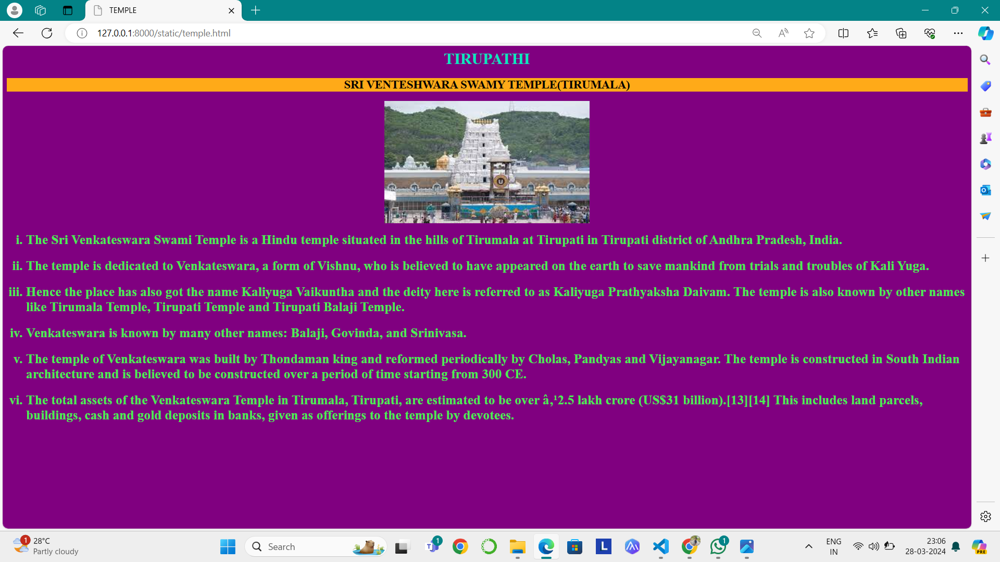
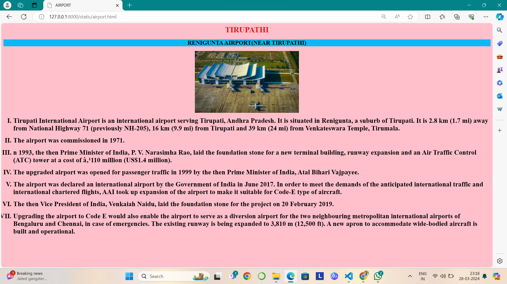
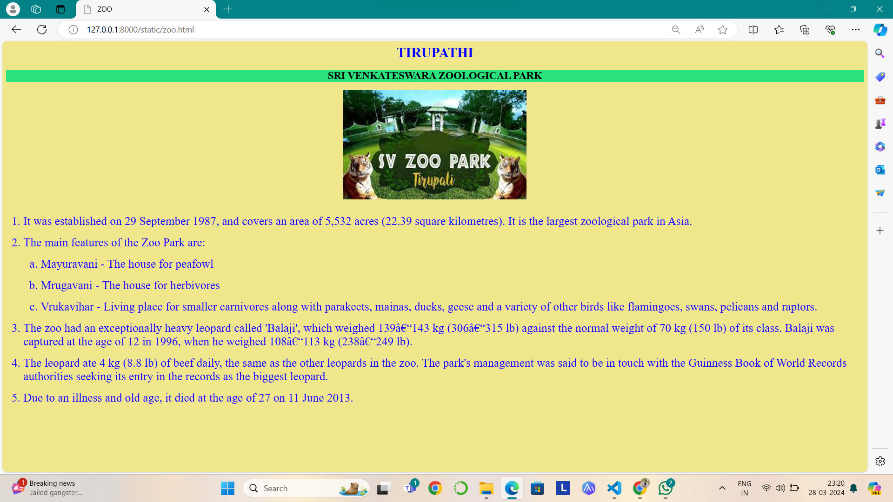
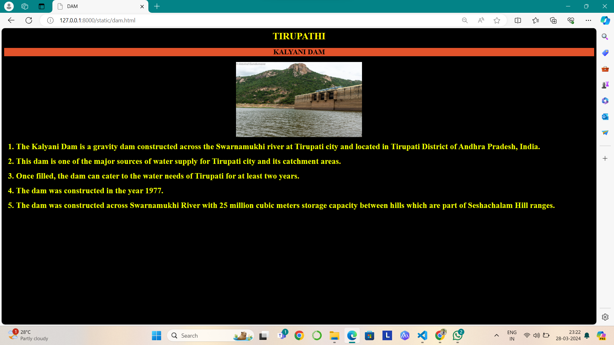

# Ex04 Places Around Me
## Date: 27/03/2024

## AIM
To develop a website to display details about the places around my house.

## DESIGN STEPS

### STEP 1
Create a Django admin interface.

### STEP 2
Download your city map from Google.

### STEP 3
Using ```<map>``` tag name the map.

### STEP 4
Create clickable regions in the image using ```<area>``` tag.

### STEP 5
Write HTML programs for all the regions identified.

### STEP 6
Execute the programs and publish them.

## CODE

### map.html
```
<!DOCTYPE html>
<html>
    <body>
        <h1 align="center">Tirupathi</h1>
        
        <map name="image-map">
            

<map name="image-map">
    <area target="" alt="TIRUPATHI ZOOLOICAL PARK" title="TIRUPATHI ZOOLOICAL PARK" href="zoo.html" coords="664,404,835,469" shape="rect">
    <area target="" alt="SRI VENKATESWARA SWAMY TEMPLE" title="SRI VENKATESWARA SWAMY TEMPLE" href="temple.html" coords="754,239,35" shape="circle">
    <area target="" alt="KALYANI DAM" title="KALYANI DAM" href="dam.html" coords="398,245,520,352" shape="rect">
    <area target="" alt="TIRUPATHI AIRPORT" title="TIRUPATHI AIRPORT" href="airport.html" coords="1489,415,48" shape="circle">
    <area target="" alt="SESCHALAM FORESTS" title="SESCHALAM FORESTS" href="forests.html" coords="336,151,580,257" shape="rect">
</map>
</map>
        </map>
    </body>
</html>
```
### forests.html
```
<html>
    <head>
        <title>FORESTS</title>
    </head>
    <body bgcolor="maroon" align="center">
        <h1 align="center" style="color:rgb(0, 255, 89)">TIRUPATHI</h1>
        <h2 align="center" style="background-color:rgb(226, 220, 43);">SESHACHALAM FORESTS</h2>
        
        <ol type="A" align="left" >
        <B>
            <li style="color:rgb(0, 255, 221); font-size:27px">Seshachalam Hills are hilly ranges part of the Eastern Ghats in southern Andhra Pradesh state, in southeastern India.</li>
            <br>
            <li style="color:rgb(0, 255, 221); font-size:27px">The Seshachalam hill ranges are predominantly present in Annamayya and Tirupati districts of the Rayalaseema region in Andhra Pradesh, India.</li>
            <br>
            <li style="color:rgb(0, 255, 221); font-size:27px">The Seshachalam hill ranges running to North West to South East, over to a length about 80 km and width ranged from 32 to 40 km in the two Rayalaseema region districts, Tirupati and Kadapa.</li>            
            <br>
            <li style="color:rgb(0, 255, 221); font-size:27px">These ranges have typical gorges and gaps due to faulting and stream erosion resulting in to discontinuous ranges. The altitude of Seshachalam hill ranges varies from 168 to 1187 m above MSL.</li>
            <br>
            <li style="color:rgb(0, 255, 221); font-size:27px">The highest hill peak is Tellaralla penta (1187 m) and most of the other hill peaks are above 900 m MSL.</li>
            <br>
            <li style="color:rgb(0, 255, 221); font-size:27px">Tirupati, a major Hindu pilgrimage town is located in the hills. The hills contain seven peaks namely, Anjanadri, Garudadri, Narayanadri, Neeladri, Seshadri, Venkatadri and Vrishabhadri, the highest at about 600 m (2,000 ft) above sea level. </li>
            <br>
            <li style="color:rgb(0, 255, 221); font-size:20px">The Srivenkateshwara National Park is also located in these ranges. The famous Natural Arch, Tirumala Hills is also a part of Seshachalam Hills, which dates back to the period in between Middle and Upper Proterozoic Eon.</li>
        </B>
        </ol>
        
    </body>
</html>
```
### temple.html
```
<html>
    <head>
        <title>TEMPLE</title>
    </head>
    <body bgcolor="purple" align="center">
        <h1 align="center" style="color:rgb(10, 230, 190)">TIRUPATHI</h1>
        <h2 align="center" style="background-color:rgb(255, 170, 24);">SRI VENTESHWARA SWAMY TEMPLE(TIRUMALA)</h2>
        
        <ol type="i" align="left" >
            <h3>
            <li style="color:rgb(74, 239, 82); font-size:27px">The Sri Venkateswara Swami Temple is a Hindu temple situated in the hills of Tirumala at Tirupati in Tirupati district of Andhra Pradesh, India. </li>
            <br>
            <li style="color:rgb(74, 239, 82); font-size:27px">The temple is dedicated to Venkateswara, a form of Vishnu, who is believed to have appeared on the earth to save mankind from trials and troubles of Kali Yuga. </li>
            <br>
            <li style="color:rgb(74, 239, 82); font-size:27px">Hence the place has also got the name Kaliyuga Vaikuntha and the deity here is referred to as Kaliyuga Prathyaksha Daivam. The temple is also known by other names like Tirumala Temple, Tirupati Temple and Tirupati Balaji Temple. </li>            
            <br>
            <li style="color:rgb(74, 239, 82); font-size:27px">Venkateswara is known by many other names: Balaji, Govinda, and Srinivasa.</li>
            <br>
            <li style="color:rgb(74, 239, 82); font-size:27px">The temple of Venkateswara was built by Thondaman king and reformed periodically by Cholas, Pandyas and Vijayanagar. The temple is constructed in South Indian architecture and is believed to be constructed over a period of time starting from 300 CE.</li>
            <br>
            <li style="color:rgb(74, 239, 82); font-size:27px">The total assets of the Venkateswara Temple in Tirumala, Tirupati, are estimated to be over ₹2.5 lakh crore (US$31 billion).[13][14] This includes land parcels, buildings, cash and gold deposits in banks, given as offerings to the temple by devotees. </li>
            </h2>
        </ol>
        
    </body>
</html>
```
### airport.html
```
<html>
    <head>
        <title>AIRPORT</title>
    </head>
    <body bgcolor="pink" align="center">
        <h1 align="center" style="color:rgb(234, 15, 22)">TIRUPATHI</h1>
        <h2 align="center" style="background-color:rgb(9, 185, 243);">RENIGUNTA AIRPORT(NEAR TIRUPATHI)</h2>
        
        <ol type="I" align="left" >
            <b>
            <li style="color:black;;font-size:27px">Tirupati International Airport is an international airport serving Tirupati, Andhra Pradesh. It is situated in Renigunta, a suburb of Tirupati. It is 2.8 km (1.7 mi) away from National Highway 71 (previously NH-205), 16 km (9.9 mi) from Tirupati and 39 km (24 mi) from Venkateswara Temple, Tirumala.</li>
            <br>
            <li style="color:black;;font-size:27px">The airport was commissioned in 1971.</li>
            <br>
            <li style="color:black;; font-size:27px">n 1993, the then Prime Minister of India, P. V. Narasimha Rao, laid the foundation stone for a new terminal building, runway expansion and an Air Traffic Control (ATC) tower at a cost of ₹110 million (US$1.4 million).</li>
            <br>
            <li style="color:rgb(0, 0, 0); font-size:27px">The upgraded airport was opened for passenger traffic in 1999 by the then Prime Minister of India, Atal Bihari Vajpayee.</li>            
            <br>
            <li style="color:rgb(0, 0, 0); font-size:27px">The airport was declared an international airport by the Government of India in June 2017. In order to meet the demands of the anticipated international traffic and international chartered flights, AAI took up expansion of the airport to make it suitable for Code-E type of aircraft.</li>
            <br>
            <li style="color:rgb(0, 0, 0); font-size:27px">The then Vice President of India, Venkaiah Naidu, laid the foundation stone for the project on 20 February 2019.</li>
            <br>
            <li style="color:rgb(0, 0, 0); font-size:27px">Upgrading the airport to Code E would also enable the airport to serve as a diversion airport for the two neighbouring metropolitan international airports of Bengaluru and Chennai, in case of emergencies. The existing runway is being expanded to 3,810 m (12,500 ft). A new apron to accommodate wide-bodied aircraft is built and operational.</li>
            <b>
        </ol>
        
    </body>
</html>
```
### zoo.html
```
<html>
    <head>
        <title>ZOO</title>
    </head>
    <body bgcolor="khaki" align="center">
        <h1 align="center" style="color:blue">TIRUPATHI</h1>
        <h2 align="center" style="background-color:rgb(43, 226, 125);">SRI VENKATESWARA ZOOLOGICAL PARK</h2>
        
        <ol type="1" align="left" >
            <br>
            <li style="color:rgb(21, 0, 255); font-size:27px">It was established on 29 September 1987, and covers an area of 5,532 acres (22.39 square kilometres). It is the largest zoological park in Asia.</li>
            <br>
            <li style="color:rgb(21, 0, 255); font-size:27px">The main features of the Zoo Park are:</li>
            <ol type="a">
                <br>
                <li style="color:rgb(21, 0, 255); font-size:27px">Mayuravani - The house for peafowl</li>
                <br>
                <li style="color:rgb(21, 0, 255); font-size:27px">Mrugavani - The house for herbivores</li>
                <br>
                <li style="color:rgb(21, 0, 255); font-size:27px">Vrukavihar - Living place for smaller carnivores along with parakeets, mainas, ducks, geese and a variety of other birds like flamingoes, swans, pelicans and raptors.</li>
            </ol>
            <br>
            <li style="color:rgb(21, 0, 255); font-size:27px">The zoo had an exceptionally heavy leopard called 'Balaji', which weighed 139–143 kg (306–315 lb) against the normal weight of 70 kg (150 lb) of its class. Balaji was captured at the age of 12 in 1996, when he weighed 108–113 kg (238–249 lb).</li>            
            <br>
            <li style="color:rgb(21, 0, 255); font-size:27px">The leopard ate 4 kg (8.8 lb) of beef daily, the same as the other leopards in the zoo. The park's management was said to be in touch with the Guinness Book of World Records authorities seeking its entry in the records as the biggest leopard.</li>
            <br>
            <li style="color:rgb(21, 0, 255); font-size:27px">Due to an illness and old age, it died at the age of 27 on 11 June 2013.</li>
            <br>
        </ol>
        
    </body>
</html>

```
### dam.html
```
<html>
    <head>
        <title>DAM</title>
    </head>
    <body bgcolor="BLACK" align="center">
        <h1 align="center" style="color:rgb(255, 247, 0)">TIRUPATHI</h1>
        <h2 align="center" style="background-color:rgb(226, 83, 43);">KALYANI DAM</h2>
        
        <ol type="1" align="left" >
            <B>
            <li style="color:rgb(238, 255, 0); font-size:27px">The Kalyani Dam is a gravity dam constructed across the Swarnamukhi river at Tirupati city and located in Tirupati District of Andhra Pradesh, India.</li>
            <br>
            <li style="color:rgb(238, 255, 0); font-size:27px">This dam is one of the major sources of water supply for Tirupati city and its catchment areas.</li>
            <br>
            <li style="color:rgb(238, 255, 0); font-size:27px">Once filled, the dam can cater to the water needs of Tirupati for at least two years.</li>
            <br>
            <li style="color:rgb(238, 255, 0); font-size:27px">The dam was constructed in the year 1977.</li>            
            <br>
            <li style="color:rgb(238, 255, 0); font-size:27px">The dam was constructed across Swarnamukhi River with 25 million cubic meters storage capacity between hills which are part of Seshachalam Hill ranges.</li>
            </B>
        </ol>
        
    </body>
</html>
```
## OUTPUT
### MAP


### FORESTS


### TEMPLE



### AIRPORT



### ZOO



### DAM



## RESULT
The program for implementing image maps using HTML is executed successfully.
